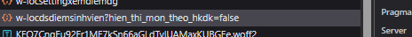
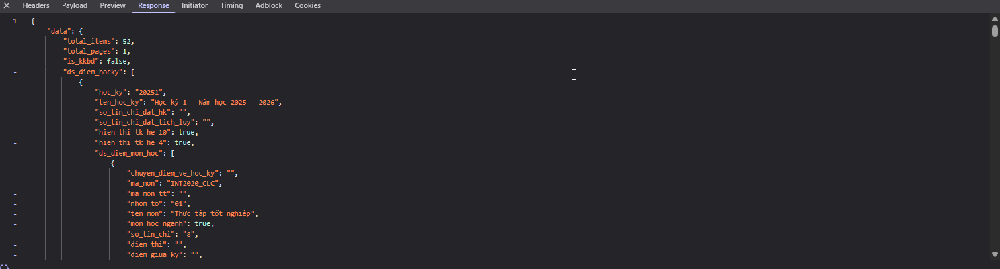

# 📊 Hướng dẫn lấy dữ liệu điểm từ hệ thống

## 🎯 Mục đích
Hướng dẫn này giúp bạn lấy dữ liệu điểm từ hệ thống quản lý học tập của trường để sử dụng với ứng dụng **Dự Kiến Điểm**.

## 📋 Các bước thực hiện

### **Bước 1: Truy cập vào giao diện xem điểm**
1. Đăng nhập vào hệ thống quản lý học tập của trường
2. Điều hướng đến trang **"Kết quả học tập"** hoặc **"Bảng điểm"**
3. Đảm bảo trang đã load đầy đủ thông tin điểm

### **Bước 2: Mở Developer Tools**
1. Nhấn phím `F12` hoặc tổ hợp phím:
   - **Windows/Linux**: `Ctrl + Shift + I`
   - **Mac**: `Cmd + Option + I`
2. Cửa sổ Developer Tools sẽ mở ra
3. Click vào tab **"Network"** (Mạng)

### **Bước 3: Tìm request API**
1. **Làm mới trang** bằng cách nhấn `F5` hoặc `Ctrl + R`
2. Quan sát danh sách các request trong tab Network
3. Tìm request có đặc điểm sau:
   - **Method**: `GET` hoặc `POST`
   - **Type**: `XHR` hoặc `Fetch`
   - **Name** chứa từ khóa: `diem`, `score`, `grade`, `result`, `transcript`
   - **Status**: `200` (thành công)



**💡 Mẹo tìm request:**
- Sắp xếp theo **Size** (kích thước) - request chứa dữ liệu điểm thường có kích thước lớn
- Lọc theo **XHR/Fetch** để chỉ hiển thị API calls
- Tìm request có response chứa JSON data

### **Bước 4: Copy response data**
1. **Click** vào request đã tìm được
2. Chuyển sang tab **"Response"** ở panel bên phải
3. Bạn sẽ thấy dữ liệu JSON như trong ảnh dưới
4. **Click chuột phải** → **"Copy"** hoặc `Ctrl + A` → `Ctrl + C`
5. Mở **Notepad** hoặc text editor bất kỳ
6. **Paste** dữ liệu vào và lưu thành file `.txt`



### **Bước 5: Chuyển đổi định dạng file**
1. **Cách 1**: Đổi tên file
   - Click chuột phải vào file `.txt`
   - Chọn **"Rename"**
   - Đổi đuôi từ `.txt` thành `.json`
   
2. **Cách 2**: Tạo file mới
   - Tạo file mới với tên `my-scores.json`
   - Copy nội dung từ file `.txt` sang file `.json`

### **Bước 6: Import vào ứng dụng**
1. Mở ứng dụng **Dự Kiến Điểm**
2. Click nút **"📁 Import file điểm"**
3. Chọn file `.json` vừa tạo
4. Ứng dụng sẽ tự động:
   - Validate cấu trúc dữ liệu
   - Load và hiển thị điểm theo học kỳ
   - Tính toán GPA hiện tại

## ⚠️ Lưu ý quan trọng

### **Bảo mật dữ liệu:**
- Dữ liệu điểm là thông tin cá nhân, không chia sẻ cho người khác
- Chỉ sử dụng trên máy tính cá nhân
- Xóa file sau khi sử dụng nếu cần thiết

### **Cấu trúc dữ liệu:**
File JSON cần có cấu trúc tối thiểu:
```json
{
  "data": {
    "ds_diem_hocky": [
      {
        "hoc_ky": "20241",
        "ten_hoc_ky": "Học kỳ 1 - Năm học 2024-2025",
        "ds_diem_mon_hoc": [...]
      }
    ]
  }
}
```

### **Xử lý lỗi thường gặp:**

**❌ "Cấu trúc dữ liệu không hợp lệ"**
- Kiểm tra file JSON có đúng format không
- Đảm bảo có trường `data.ds_diem_hocky`

**❌ "Không thể tìm thấy dữ liệu JSON"**
- Copy lại response từ đầu
- Kiểm tra đã copy đúng request chứa dữ liệu điểm

**❌ "File không đọc được"**
- Đảm bảo file có đuôi `.json`
- Kiểm tra encoding của file (nên là UTF-8)

## 🔧 Công cụ hỗ trợ

### **Validate JSON:**
- [JSONLint](https://jsonlint.com/) - Kiểm tra JSON hợp lệ
- [JSON Formatter](https://jsonformatter.curiousconcept.com/) - Format JSON đẹp

### **Text Editors khuyên dùng:**
- **VS Code** - Có syntax highlighting cho JSON
- **Notepad++** - Nhẹ và hỗ trợ nhiều format
- **Sublime Text** - Nhanh và mạnh mẽ

## 📞 Hỗ trợ

Nếu gặp khó khăn trong quá trình lấy dữ liệu:
1. Kiểm tra lại từng bước trong hướng dẫn
2. Thử với trình duyệt khác (Chrome, Firefox, Edge)
3. Liên hệ qua GitHub Issues để được hỗ trợ

---

**💡 Tip**: Sau khi lấy được dữ liệu lần đầu, bạn có thể sử dụng ứng dụng để dự kiến điểm cho các môn sắp thi mà không cần lấy dữ liệu lại!
