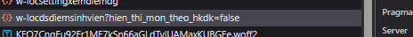
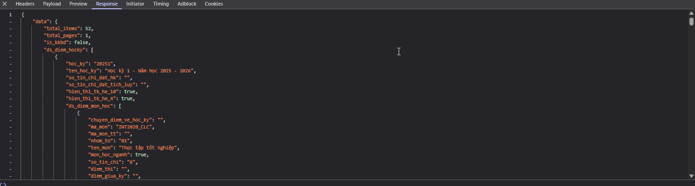

# 📊 Dự Kiến Điểm - Grade Prediction Tool

Ứng dụng web đơn giản giúp sinh viên xem kết quả học tập và dự kiến điểm số để tính toán GPA tương lai.

## 🎓 Đối tượng sử dụng

**🏫 Dành cho sinh viên:**
- **Học viện Công nghệ Bưu chính Viễn thông (PTIT)** - Hỗ trợ đầy đủ
- **Các trường đại học khác** có hệ thống QLDT tương tự với cấu trúc dữ liệu JSON

> **Lưu ý**: Ứng dụng được thiết kế dựa trên cấu trúc dữ liệu của hệ thống QLDT PTIT, nhưng có thể tương thích với các trường khác nếu có format dữ liệu tương tự.

## 🌐 Demo trực tuyến

**🚀 [Truy cập ứng dụng tại đây](https://tain03.github.io/DuKienDiem/)**

> Ứng dụng được deploy tự động lên GitHub Pages mỗi khi có commit mới.

## ✨ Tính năng chính

### 📋 Hiển thị kết quả học tập
- Xem điểm theo từng học kỳ với bảng chi tiết
- Hiển thị đầy đủ: STT, Mã MH, Nhóm/tổ, Tên môn học, Số tín chỉ, Điểm thi, Điểm TK (10), Điểm TK (4), Điểm TK (C), Kết quả, Chi tiết
- Thống kê điểm trung bình tích lũy và tổng tín chỉ đạt

### 🎯 Chức năng dự kiến điểm
- **Dự kiến điểm cho TẤT CẢ môn học** (kể cả môn chưa có điểm)
- Click vào cột "Điểm TK (10)" để nhập điểm dự kiến
- Tự động tính toán:
  - Điểm thang 4
  - Điểm chữ (A+, A, B+, B, C+, C, D+, D, F)
  - Kết quả đạt/không đạt
  - Điểm trung bình tích lũy mới

### 📁 Import file điểm
- Hỗ trợ file `.json` và `.js`
- Import file điểm từ máy tính
- Tự động validate cấu trúc dữ liệu

### 📊 Thang điểm chuẩn
| Thang 10 | Điểm chữ | Thang 4 | Kết quả |
|----------|----------|---------|---------|
| 9.0 - 10.0 | A+ | 4.0 | Đạt |
| 8.5 - 8.9 | A | 3.7 | Đạt |
| 8.0 - 8.4 | B+ | 3.5 | Đạt |
| 7.0 - 7.9 | B | 3.0 | Đạt |
| 6.5 - 6.9 | C+ | 2.5 | Đạt |
| 5.5 - 6.4 | C | 2.0 | Đạt |
| 5.0 - 5.4 | D+ | 1.5 | Đạt |
| 4.0 - 4.9 | D | 1.0 | Đạt |
| < 4.0 | F | 0.0 | Không đạt |

## 🚀 Cách sử dụng

### 1. Cài đặt
```bash
git clone https://github.com/tain03/DuKienDiem.git
cd DuKienDiem
```

### 2. Chạy ứng dụng
- Mở file `index.html` bằng trình duyệt web
- Hoặc sử dụng Live Server nếu có VS Code

### 3. Lấy dữ liệu điểm từ hệ thống

#### 📋 **Hướng dẫn chi tiết:**

**Bước 1:** Truy cập vào giao diện xem điểm của trường
- Đăng nhập vào hệ thống quản lý học tập
- Vào trang xem kết quả học tập/bảng điểm

**Bước 2:** Mở Developer Tools
- Nhấn phím `F12` hoặc `Ctrl + Shift + I`
- Chuyển sang tab **"Network"**

**Bước 3:** Tìm request API
- Refresh trang hoặc thực hiện thao tác load điểm
- Tìm request có tên tương tự như trong ảnh `request.png`
- Thường là request có chứa từ khóa: `diem`, `score`, `grade`, `result`



**Bước 4:** Copy response data
- Click vào request đã tìm được
- Chuyển sang tab **"Response"**
- Copy toàn bộ nội dung JSON như trong ảnh `response.png`
- Lưu vào file `.txt` trước



**Bước 5:** Chuyển đổi định dạng
- Đổi tên file từ `.txt` thành `.json`
- Hoặc tạo file mới với đuôi `.json`

**Bước 6:** Import vào ứng dụng
- Click nút "📊 Import file điểm"
- Chọn file `.json` vừa tạo
- Ứng dụng sẽ tự động load và hiển thị

### 4. Lấy dữ liệu chương trình đào tạo (Tùy chọn)

Để sử dụng tính năng dự kiến điểm cho **môn chưa học**, bạn cần thêm dữ liệu chương trình đào tạo:

**Các bước tương tự như lấy dữ liệu điểm:**
1. Vào trang **"Chương trình đào tạo"** trong hệ thống QLDT
2. Mở Developer Tools (F12) → tab Network
3. Tìm request chứa dữ liệu CTĐT (thường có từ khóa `ctdt`, `curriculum`)
4. Copy response và lưu thành file `.json`
5. Import vào ứng dụng bằng nút **"📚 Import CTĐT"**

> 📖 **[Xem hướng dẫn chi tiết với ảnh minh họa](https://github.com/tain03/DuKienDiem/blob/main/HUONG-DAN-LAY-DU-LIEU.md)**

### 4. Dự kiến điểm
1. Bật "Chế độ dự kiến điểm"
2. Click vào ô điểm bất kỳ (cột "Điểm TK (10)")
3. Nhập điểm dự kiến (0-10)
4. Xem kết quả GPA mới ngay lập tức

## 🏫 Tương thích với các trường

### **✅ Đã test và hoạt động:**
- **PTIT (Học viện Công nghệ Bưu chính Viễn thông)** - 100% tương thích

### **🔄 Có thể tương thích:**
Các trường có hệ thống QLDT với cấu trúc dữ liệu tương tự:
- **UET (Đại học Công nghệ - ĐHQGHN)**
- **HUST (Đại học Bách khoa Hà Nội)**
- **NEU (Đại học Kinh tế Quốc dân)**
- **Các trường khác** sử dụng hệ thống quản lý tương tự

### **🛠️ Cách kiểm tra tương thích:**
1. Làm theo hướng dẫn lấy dữ liệu
2. Kiểm tra cấu trúc JSON có giống mẫu dưới không
3. Nếu khác biệt, có thể cần chỉnh sửa nhỏ

## 📁 Cấu trúc dữ liệu

File điểm cần có cấu trúc JSON như sau (dựa trên hệ thống PTIT):

```json
{
  "data": {
    "total_items": 52,
    "ds_diem_hocky": [
      {
        "hoc_ky": "20241",
        "ten_hoc_ky": "Học kỳ 1 - Năm học 2024 - 2025",
        "dtb_hk_he10": "6.79",
        "dtb_hk_he4": "2.49",
        "ds_diem_mon_hoc": [
          {
            "ma_mon": "INT1313_CLC",
            "ten_mon": "Cơ sở dữ liệu",
            "so_tin_chi": "3",
            "diem_tk": "6.7",
            "diem_tk_so": "2.5",
            "diem_tk_chu": "C+",
            "ket_qua": 1,
            "khong_tinh_diem_tbtl": 0
          }
        ]
      }
    ]
  }
}
```

## 🛠️ Công nghệ sử dụng

- **HTML5** - Cấu trúc trang web
- **CSS3** - Styling và responsive design
- **Vanilla JavaScript** - Logic xử lý và tương tác
- **JSON** - Lưu trữ dữ liệu điểm

## 📱 Responsive Design

- Tương thích với desktop, tablet và mobile
- Giao diện thân thiện, dễ sử dụng
- Dark/Light theme tự động theo hệ thống

## ❓ FAQ - Câu hỏi thường gặp

### **Q: Tôi không phải sinh viên PTIT, có dùng được không?**
A: Có thể! Nếu trường bạn có hệ thống QLDT với cấu trúc dữ liệu JSON tương tự, ứng dụng sẽ hoạt động bình thường.

### **Q: Làm sao biết trường mình có tương thích không?**
A: Thử làm theo hướng dẫn lấy dữ liệu. Nếu response có cấu trúc `data.ds_diem_hocky` thì có thể sử dụng.

### **Q: Dữ liệu có bị lưu trữ ở đâu không?**
A: Không! Tất cả dữ liệu chỉ được xử lý trên trình duyệt của bạn, không gửi lên server nào.

### **Q: Có thể thêm hỗ trợ cho trường khác không?**
A: Có! Tạo issue với mẫu dữ liệu của trường bạn, chúng tôi sẽ hỗ trợ thêm tương thích.


## 🤝 Đóng góp

1. Fork repository
2. Tạo branch mới (`git checkout -b feature/AmazingFeature`)
3. Commit changes (`git commit -m 'Add some AmazingFeature'`)
4. Push to branch (`git push origin feature/AmazingFeature`)
5. Mở Pull Request

## 📄 License

Distributed under the MIT License. See `LICENSE` for more information.

## 👨‍💻 Tác giả

**Nguyễn Đức Tài** - [@tain03](https://github.com/tain03)
- 🎓 Sinh viên PTIT (Học viện Công nghệ Bưu chính Viễn thông)
- 💻 Chuyên ngành: Công nghệ thông tin

## 🙏 Acknowledgments

- Cảm ơn các bạn sinh viên PTIT đã đóng góp ý kiến và test ứng dụng
- Inspired by PTIT's academic management system
- Built with ❤️ for Vietnamese students, especially PTITers
- Special thanks to PTIT's QLDT system for data structure reference

---

⭐ **Nếu project hữu ích, hãy cho một star nhé!** ⭐
